 

 

In the photo carousels below, click the left or right edge of the image to browse through the pictures. Please note that the light-colored arrow may be difficult to see if the image has a light background.

<h1 style="margin: 30px 0px 10px 0px">
    Opening words & excursion
</h1>

  <ol class="carousel-indicators">
    <li data-target="#nordan-general" data-slide-to="0" class="active"></li>
    <li data-target="#nordan-general" data-slide-to="1"></li>
  </ol>
  

    

      
      

        <h1 style="color: white; text-shadow: -1px -1px 0 #000, 1px -1px 0 #000, -1px 1px 0 #000, 1px 1px 0 #000; ">
            <b>
                Opening words: Risto Korhonen
            </b>
        </h1>
      

    

    

      
      

        <h1 style="color: white; text-shadow: -1px -1px 0 #000, 1px -1px 0 #000, -1px 1px 0 #000, 1px 1px 0 #000; ">
            <b>
                Excursion: Koli
            </b>
        </h1>
      

    

  

  <a class="carousel-control-prev" href="#nordan-general" role="button" data-slide="prev">
    
    Previous
  </a>
  <a class="carousel-control-next" href="#nordan-general" role="button" data-slide="next">
    
    Next
  </a>
  

<h1 style="margin: 30px 0px 10px 0px">
    Nordan speakers
</h1>

  <ol class="carousel-indicators">
    <li data-target="#nordan-speakers" data-slide-to="0" class="active"></li>
    <li data-target="#nordan-speakers" data-slide-to="1"></li>
    <li data-target="#nordan-speakers" data-slide-to="2"></li>
    <li data-target="#nordan-speakers" data-slide-to="3"></li>
    <li data-target="#nordan-speakers" data-slide-to="4"></li>
    <li data-target="#nordan-speakers" data-slide-to="5"></li>
    <li data-target="#nordan-speakers" data-slide-to="6"></li>
    <li data-target="#nordan-speakers" data-slide-to="7"></li>
  </ol>
  

    

      
      

        <h1 style="color: white; text-shadow: -1px -1px 0 #000, 1px -1px 0 #000, -1px 1px 0 #000, 1px 1px 0 #000; ">
            <b>
                Ilpo Laine
            </b>
        </h1>
      

    

    

      
      

        <h1 style="color: white; text-shadow: -1px -1px 0 #000, 1px -1px 0 #000, -1px 1px 0 #000, 1px 1px 0 #000; ">
            <b>
                Ragnar Sigurðsson
            </b>
        </h1>
      

    

    

      
      

        <h1 style="color: white; text-shadow: -1px -1px 0 #000, 1px -1px 0 #000, -1px 1px 0 #000, 1px 1px 0 #000; ">
            <b>
                Jacob Stordal Christiansen
            </b>
        </h1>
      

    

    

      
      

        <h1 style="color: white; text-shadow: -1px -1px 0 #000, 1px -1px 0 #000, -1px 1px 0 #000, 1px 1px 0 #000; ">
            <b>
                Álfheiður Edda Sigurðardóttir
            </b>
        </h1>
      

    

    

      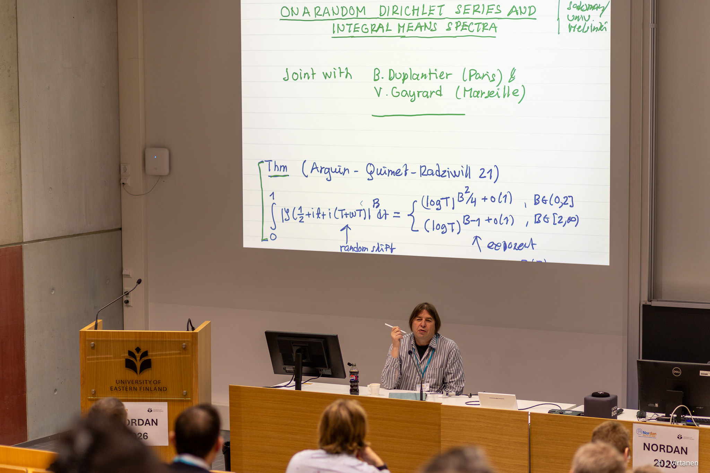
      

        <h1 style="color: white; text-shadow: -1px -1px 0 #000, 1px -1px 0 #000, -1px 1px 0 #000, 1px 1px 0 #000; ">
            <b>
                Eero Saksman
            </b>
        </h1>
      

    

    

      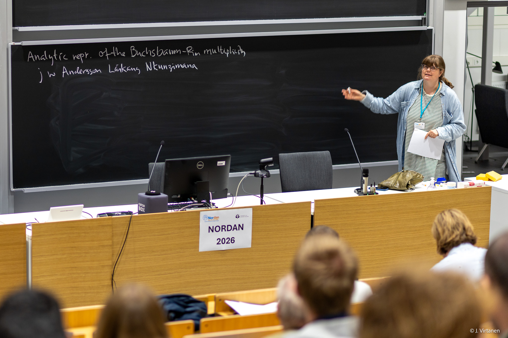
      

        <h1 style="color: white; text-shadow: -1px -1px 0 #000, 1px -1px 0 #000, -1px 1px 0 #000, 1px 1px 0 #000; ">
            <b>
                Elizabeth Wulcan
            </b>
        </h1>
      

    

    

      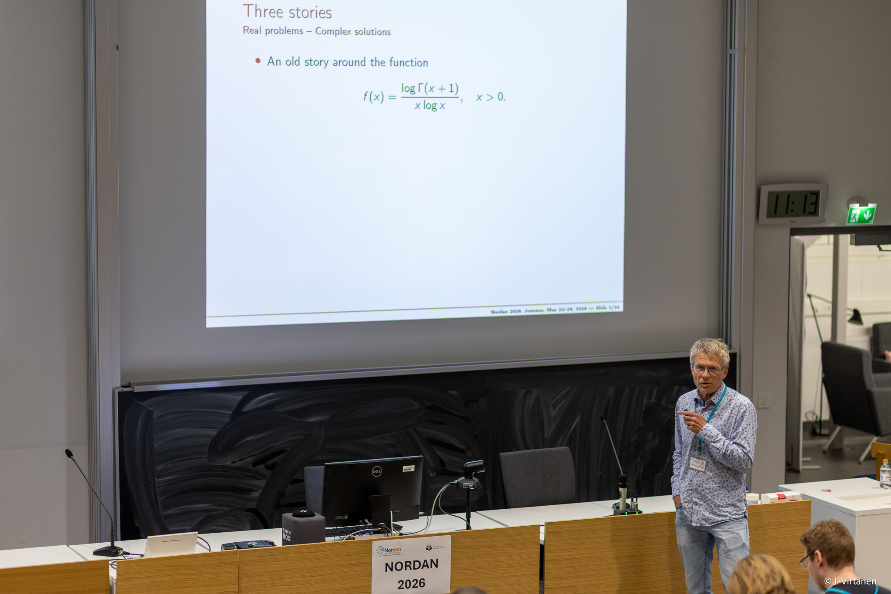
      

        <h1 style="color: white; text-shadow: -1px -1px 0 #000, 1px -1px 0 #000, -1px 1px 0 #000, 1px 1px 0 #000; ">
            <b>
               Henrik Laurberg Pedersen
            </b>
        </h1>
      

    

    

      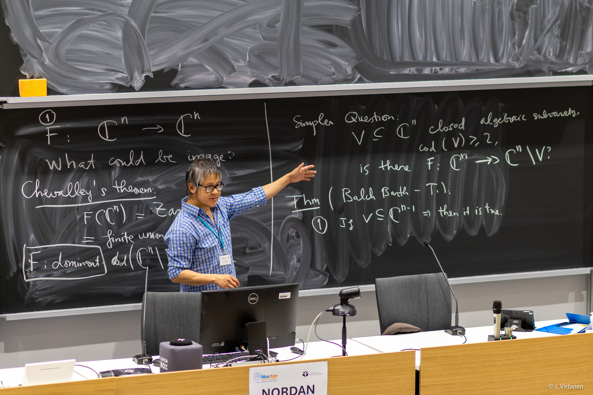
      

        <h1 style="color: white; text-shadow: -1px -1px 0 #000, 1px -1px 0 #000, -1px 1px 0 #000, 1px 1px 0 #000; ">
            <b>
                Tuyen Trung Truong
            </b>
        </h1>
      

    

  

  <a class="carousel-control-prev" href="#nordan-speakers" role="button" data-slide="prev">
    
    Previous
  </a>
  <a class="carousel-control-next" href="#nordan-speakers" role="button" data-slide="next">
    
    Next
  </a>
  

<h1 style="margin: 30px 0px 10px 0px">
    KAUS speakers
</h1>

  <ol class="carousel-indicators">
    <li data-target="#kaus-speakers" data-slide-to="0" class="active"></li>
    <li data-target="#kaus-speakers" data-slide-to="1"></li>
    <li data-target="#kaus-speakers" data-slide-to="2"></li>
    <li data-target="#kaus-speakers" data-slide-to="3"></li>
    <li data-target="#kaus-speakers" data-slide-to="4"></li>
    <li data-target="#kaus-speakers" data-slide-to="5"></li>
    <li data-target="#kaus-speakers" data-slide-to="6"></li>
    <li data-target="#kaus-speakers" data-slide-to="7"></li>
    <li data-target="#kaus-speakers" data-slide-to="8"></li>
    <li data-target="#kaus-speakers" data-slide-to="9"></li>
    <li data-target="#kaus-speakers" data-slide-to="10"></li>
    <li data-target="#kaus-speakers" data-slide-to="11"></li>
    <li data-target="#kaus-speakers" data-slide-to="12"></li>
  </ol>
  

    

      
      

        <h1 style="color: white; text-shadow: -1px -1px 0 #000, 1px -1px 0 #000, -1px 1px 0 #000, 1px 1px 0 #000; ">
            <b>
                 Siyu Wang
            </b>
        </h1>
      

    

    

      
      

        <h1 style="color: white; text-shadow: -1px -1px 0 #000, 1px -1px 0 #000, -1px 1px 0 #000, 1px 1px 0 #000; ">
            <b>
                Przemysław Sprus
            </b>
        </h1>
      

    

    

      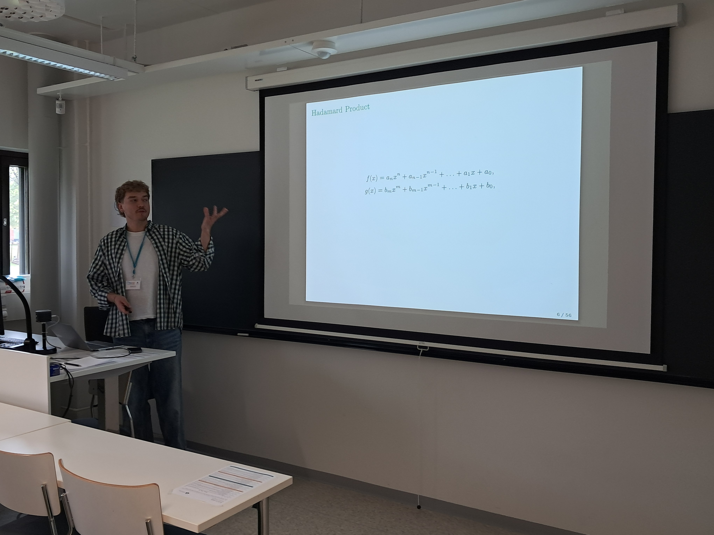
      

        <h1 style="color: white; text-shadow: -1px -1px 0 #000, 1px -1px 0 #000, -1px 1px 0 #000, 1px 1px 0 #000; ">
            <b>
                 Michał Kudra
            </b>
        </h1>
      

    

    

      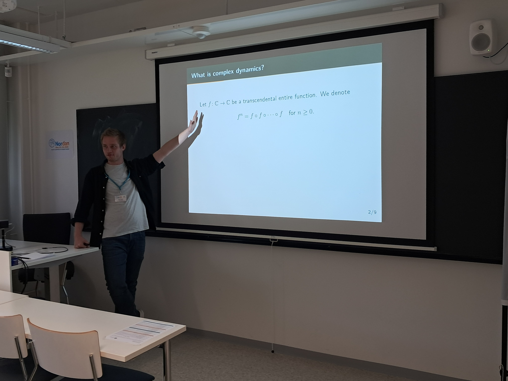
      

        <h1 style="color: white; text-shadow: -1px -1px 0 #000, 1px -1px 0 #000, -1px 1px 0 #000, 1px 1px 0 #000; ">
            <b>
                 Beno Učakar
            </b>
        </h1>
      

    

    

      
      

        <h1 style="color: white; text-shadow: -1px -1px 0 #000, 1px -1px 0 #000, -1px 1px 0 #000, 1px 1px 0 #000; ">
            <b>
                João Fontinha 
            </b>
        </h1>
      

    

    

      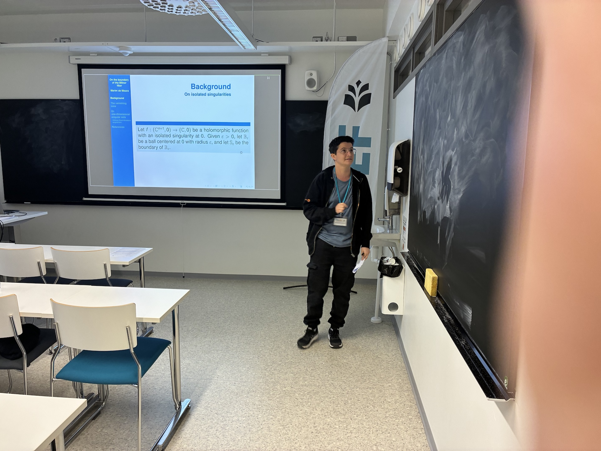
      

        <h1 style="color: white; text-shadow: -1px -1px 0 #000, 1px -1px 0 #000, -1px 1px 0 #000, 1px 1px 0 #000; ">
            <b>
                 Benjamin Marim de Moura
            </b>
        </h1>
      

    

    

      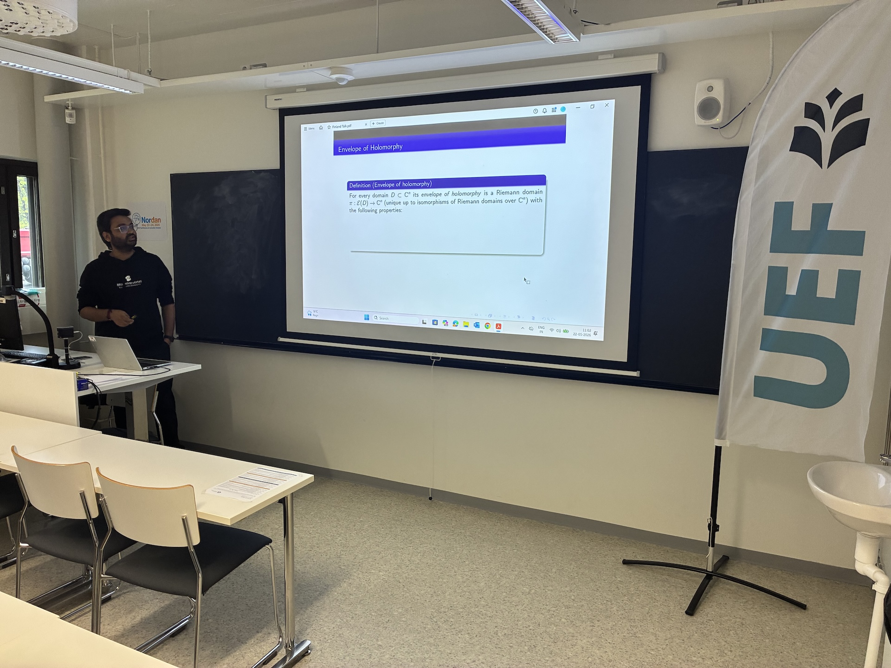
      

        <h1 style="color: white; text-shadow: -1px -1px 0 #000, 1px -1px 0 #000, -1px 1px 0 #000, 1px 1px 0 #000; ">
            <b>
                Suprokash Hazra
            </b>
        </h1>
      

    

    

      
      

        <h1 style="color: white; text-shadow: -1px -1px 0 #000, 1px -1px 0 #000, -1px 1px 0 #000, 1px 1px 0 #000; ">
            <b>
                Aleksandra Le
            </b>
        </h1>
      

    

    

      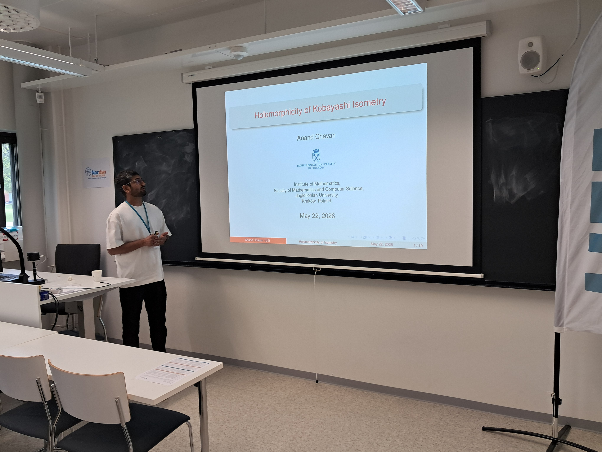
      

        <h1 style="color: white; text-shadow: -1px -1px 0 #000, 1px -1px 0 #000, -1px 1px 0 #000, 1px 1px 0 #000; ">
            <b>
                Anand Chavan
            </b>
        </h1>
      

    

    

      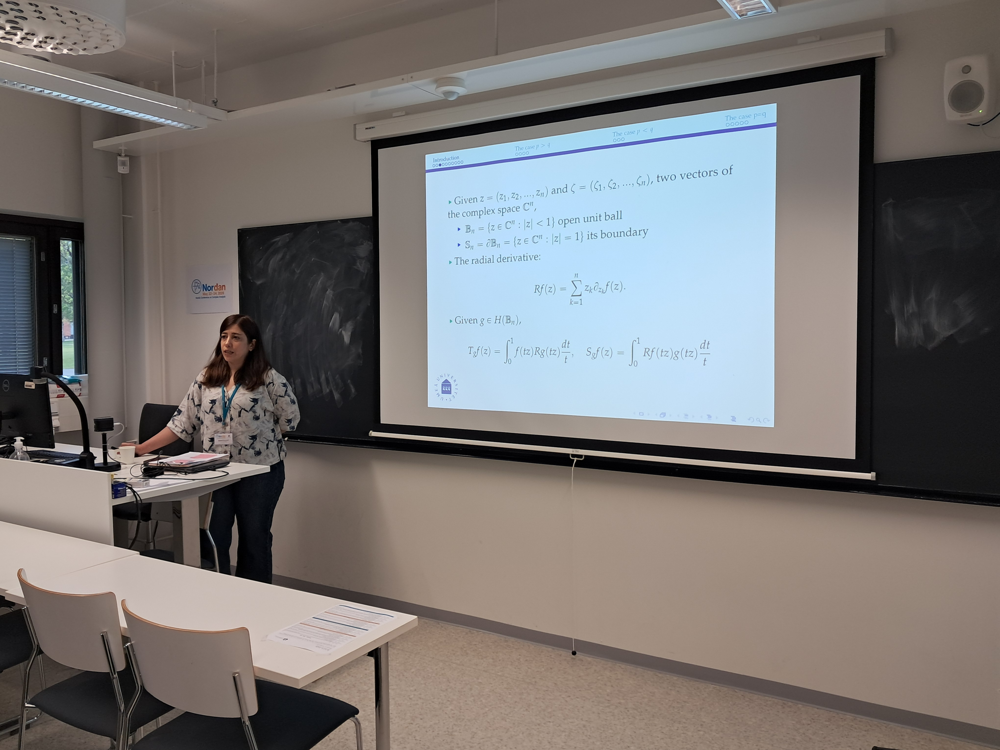
      

        <h1 style="color: white; text-shadow: -1px -1px 0 #000, 1px -1px 0 #000, -1px 1px 0 #000, 1px 1px 0 #000; ">
            <b>
                Setareh Eskandari
            </b>
        </h1>
      

    

    

      
      

        <h1 style="color: white; text-shadow: -1px -1px 0 #000, 1px -1px 0 #000, -1px 1px 0 #000, 1px 1px 0 #000; ">
            <b>
                 Fani Xerakia
            </b>
        </h1>
      

    

    

      
      

        <h1 style="color: white; text-shadow: -1px -1px 0 #000, 1px -1px 0 #000, -1px 1px 0 #000, 1px 1px 0 #000; ">
            <b>
                Atte Pennanen
            </b>
        </h1>
      

      

     

      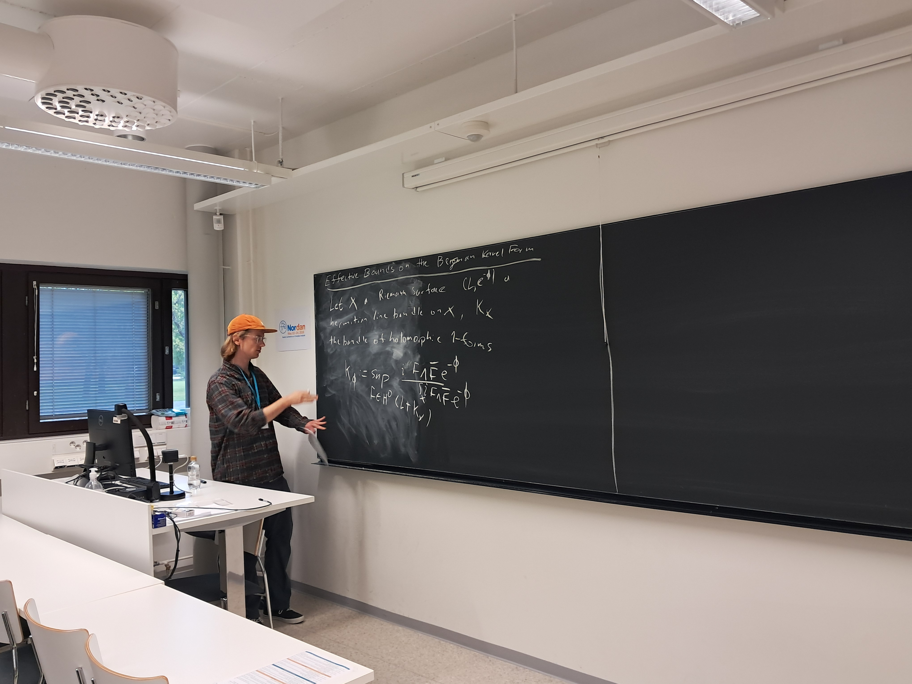
      

        <h1 style="color: white; text-shadow: -1px -1px 0 #000, 1px -1px 0 #000, -1px 1px 0 #000, 1px 1px 0 #000; ">
            <b>
                Johannes Testorf
            </b>
        </h1>
      

    
     
  

  <a class="carousel-control-prev" href="#kaus-speakers" role="button" data-slide="prev">
    
    Previous
  </a>
  <a class="carousel-control-next" href="#kaus-speakers" role="button" data-slide="next">
    
    Next
  </a>

